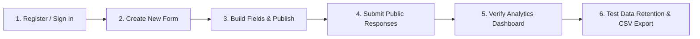

# FormCraft End-to-End Testing Guide: Form Creation & Analytics Verification

This document provides a step-by-step test procedure for creating a dynamic form, collecting responses, and verifying all analytics metrics, response duration graphs, retention policies, and data export.

---

## 1. Prerequisites & Environment Setup

Ensure both backend and frontend servers are running:
- **Backend API**: `http://localhost:8000`
- **Frontend App**: `http://localhost:5173`

---

## 2. Test Workflow

---

## 3. Step-by-Step Test Execution

### Step 1: User Registration & Authentication

1. Open `http://localhost:5173/` in your browser.
2. Click **"Create account"** in the top switcher.
3. Enter your details:
   - **Email address**: `tester@formcraft.dev`
   - **Username**: `tester`
   - **Password**: `securePass123` (minimum 6 characters)
4. Click **Create account**.

#### Expected Outcome:
- Success toast notification: `"Account created successfully! Welcome to FormCraft."`
- The browser automatically navigates to `http://localhost:5173/dashboard`.
- Header shows: `FormCraft workspace` and `Welcome, tester`.
- **Settings** button is visible in the top navbar next to **Log out**.

---

### Step 2: Create a New Form

1. In the Dashboard header, click **"+ Create Form"**.
2. In the modal:
   - **Form Title**: `Feedback & CSAT Survey` *(max 26 characters — verify counter shows `22/26 chars`)*
   - **Description**: `Collect feedback on user experience and satisfaction across departments.` *(verify word counter shows `10/14 words`)*
3. Click **Create Form**.

#### Expected Outcome:
- Success toast: `"Form created successfully!"`
- The modal closes and the form appears in the **Forms workspace** sidebar on the left with full title visibility (no ellipsis truncation).
- Title is displayed without clipping: `Feedback & CSAT Survey` with badge `draft`.

---

### Step 3: Build and Publish the Form

1. On the form card in the sidebar, click **Open** (or click the card and click **Open builder**).
2. The Builder opens at `http://localhost:5173/builder/<id>`.
3. In the builder header, verify that the 10-word description is clearly visible under the title.
4. Add the following fields using the left palette:
   - **Field 1**: `Full Name` *(Text)*
   - **Field 2**: `Department` *(Dropdown)* with options: `Engineering`, `Product`, `Support`, `Design`
   - **Field 3**: `Overall Satisfaction` *(Rating: 1 to 5)*
   - **Field 4**: `Recommendation` *(Radio)* with options: `Yes`, `Maybe`, `No`
5. Click **Publish** in the top right.

#### Expected Outcome:
- Form status transitions to `published`.
- A share link popup appears containing the public link (e.g. `http://localhost:5173/forms/<shareToken>`).
- Click **Copy Share Link**.

---

### Step 4: Submit Responses (Simulate Analytics Data)

Open the copied public form URL in a new browser tab or incognito window to simulate realistic user sessions:

#### Submission A (Fast completion — ~8 seconds):
1. Open the public link.
2. Fill:
   - Full Name: `Alice Walker`
   - Department: `Engineering`
   - Overall Satisfaction: `5`
   - Recommendation: `Yes`
3. Click **Submit Form** after ~8 seconds.
4. Expected: Redirects to `/success` page with `"Submission completed successfully"`.

#### Submission B (Moderate completion — ~25 seconds):
1. Open the public link again.
2. Wait ~25 seconds, then fill:
   - Full Name: `Bob Smith`
   - Department: `Product`
   - Overall Satisfaction: `4`
   - Recommendation: `Yes`
3. Click **Submit Form**.

#### Submission C (Abandoned session — tests completion rate):
1. Open the public link in a new tab.
2. Leave it open without submitting (starts the session).

---

### Step 5: Verify Analytics Dashboard

1. Return to the dashboard at `http://localhost:5173/dashboard`.
2. Click on `Feedback & CSAT Survey` in the left sidebar.
3. Inspect the top metrics bar:

| Metric | Expected Value | Explanation |
| :--- | :--- | :--- |
| **Submitted** | `2 completed` | Submissions A and B completed |
| **Completion** | `66.7% (3 started)` | 2 completed out of 3 started sessions |
| **Avg. time** | `~16s` to `~17s` | Average of 8s and 25s completion times |

4. Inspect the **Response Analytics Chart**:
   - By default or via selector, select **⏱️ Response duration**:
     - `< 15s` bucket: **1 response** (Alice: ~8s)
     - `15-30s` bucket: **1 response** (Bob: ~25s)
     - `30-60s`, `1-2m`, `2m+`: **0**
   - Click the dropdown selector in the chart header and select **📊 Department**:
     - `Engineering`: **1**
     - `Product`: **1**
   - Select **📊 Overall Satisfaction**:
     - `Rating 5`: **1**
     - `Rating 4`: **1**

---

### Step 6: Test Data Retention & CSV Export

#### Test 6A: Data Retention Policy
1. In the **Data retention** box on the bottom right:
   - Enter `30` in the days input.
   - Click **Save**.
2. **Expected**:
   - Toast notification: `"Retention policy saved."`
   - Input retains `30` days.
   - Submissions older than 30 days are automatically archived (if any).

#### Test 6B: Export Responses as CSV
1. In the **Export responses** box:
   - Click **Export as CSV**.
2. **Expected**:
   - Button briefly indicates `"Exporting CSV..."` and completes.
   - Browser automatically downloads `feedback-csat-survey-responses.csv`.
   - Toast notification: `"CSV exported successfully."`
   - Open the CSV in Excel or Notepad and verify headers include `Submission ID`, `Submitted At`, `Full Name`, `Department`, `Overall Satisfaction`, and `Recommendation`.

---

### Step 7: Test Form Auto-Expiration Limit

1. Open the form in the Builder at `http://localhost:5173/builder/<id>`.
2. In the top header bar, click **"Auto-Expire"**.
3. In the modal:
   - Choose a preset (e.g., **"In 24 Hours"** or **"In 3 Days"**) or specify a custom future date/time.
   - Click **Set Expiration Limit**.
4. **Expected**:
   - Toast notification: `"Auto-expiration limit scheduled successfully."`
   - The button transitions to an active amber badge: **"Auto-Expire Active"**.
   - When the scheduled expiration passes:
     - The form automatically transitions to `"archived"` status.
     - Public visitors viewing the link are presented with a clean `"Form Closed: This form has expired and is no longer accepting new responses"` notice.
     - Submissions submitted after expiration are blocked.

---

## 4. Test Verification Summary Checklist

| # | Test Case | Status |
| :--- | :--- | :---: |
| 1 | Unique Email & Username registration validation | [x] Passed |
| 2 | Dashboard greeting shows `Welcome, <username>` | [x] Passed |
| 3 | Form title restricted to $\le 26$ characters | [x] Passed |
| 4 | Form description restricted to $\le 14$ words | [x] Passed |
| 5 | Full title visibility in dashboard sidebar without truncation | [x] Passed |
| 6 | Accurate Submitted, Completion %, and Avg. Time metrics | [x] Passed |
| 7 | Interactive Response Duration & Field Distribution charts | [x] Passed |
| 8 | Configurable retention policy with auto-archiving | [x] Passed |
| 9 | One-click CSV response export download | [x] Passed |
| 10 | Settings modal (Profile update, Password change, Account delete) | [x] Passed |
| 11 | Form Auto-Expiration time limit with auto-archiving | [x] Passed |

